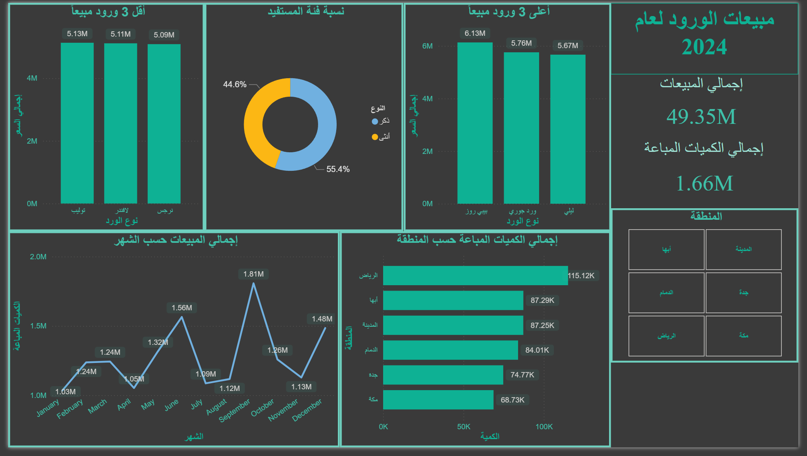
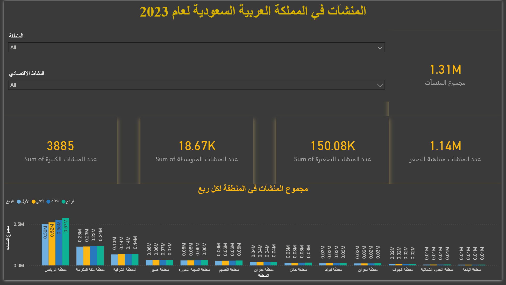
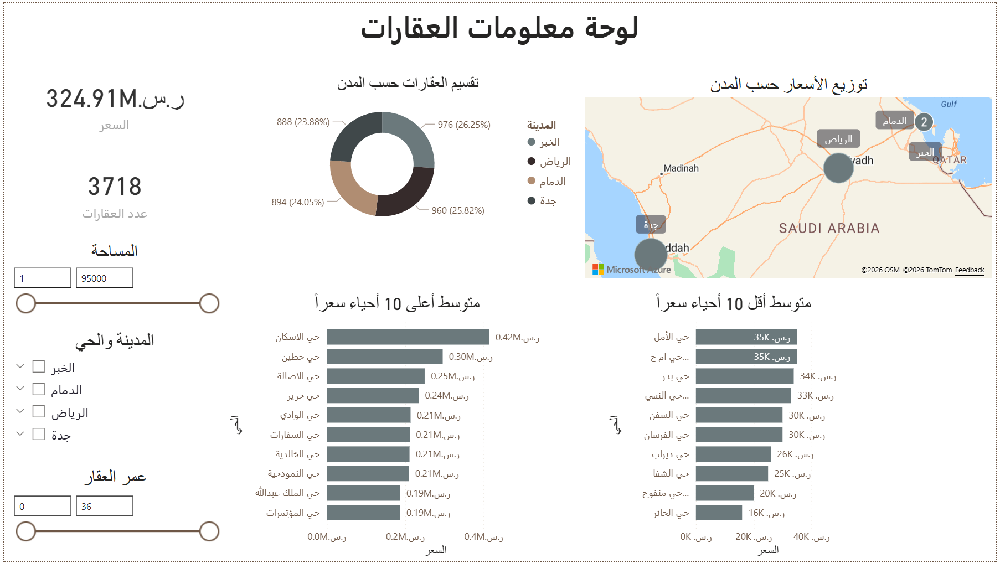

# 📊 لوحات معلومات تفاعلية | Power BI Dashboards

> **ع:** مجموعة لوحات معلومات تفاعلية باستخدام Power BI، تحلل بيانات سعودية حقيقية في قطاعات المبيعات، المنشآت، والعقارات. تم بناؤها ضمن برنامج تدريبي متخصص في تحليل البيانات.

> **EN:** A collection of interactive Power BI dashboards analyzing Saudi-context data across sales, business establishments, and real estate sectors. Built during a specialized data analytics training program.

---

## 1️⃣ مبيعات الورود لعام 2024 | Rose Sales Dashboard 2024

**ع:** لوحة تحليلية لأداء مبيعات متجر ورود خلال عام 2024، تتتبع إجمالي المبيعات، أنواع الورود الأعلى والأقل مبيعاً، وتوزيع العملاء جغرافياً وديموغرافياً.

**EN:** A sales performance dashboard for a flower retail business in 2024, tracking revenue, top/bottom product performance, and customer distribution by region and gender.

### 📌 أبرز المؤشرات | Key Metrics

| المؤشر | القيمة |
|--------|--------|
| إجمالي المبيعات | 49.35M ريال |
| إجمالي الكميات المباعة | 1.66M وحدة |
| أعلى مبيعاً | ورد ليلي (6.13M) |
| أقل مبيعاً | توليب (5.09M) |
| أعلى شهر | سبتمبر (1.81M) |
| أعلى منطقة | الرياض (115.12K وحدة) |
| توزيع العملاء | ذكور 55.4% / إناث 44.6% |

**المهارات المطبقة | Skills Applied:**
- تحليل الاتجاهات الشهرية عبر Line Chart
- ترتيب المنتجات أعلى وأقل مبيعاً عبر Bar Charts
- تقسيم العملاء بالجنس عبر Donut Chart
- فلتر جغرافي تفاعلي حسب المنطقة (Slicer)
- بطاقات KPI للمؤشرات الرئيسية

📁 `Sales_-_مبيعات_الورود.pbix`

---

## 2️⃣ المنشآت في المملكة العربية السعودية 2023 | Saudi Establishments 2023

**ع:** لوحة تحليلية لبيانات المنشآت الاقتصادية في المملكة مصنفةً حسب الحجم (كبيرة، متوسطة، صغيرة، متناهية الصغر) والمنطقة الجغرافية والنشاط الاقتصادي.

**EN:** An analytical dashboard for Saudi economic establishments data, classified by size (large, medium, small, micro), geographic region, and economic activity type.

### 📌 أبرز المؤشرات | Key Metrics

| المؤشر | القيمة |
|--------|--------|
| إجمالي المنشآت | 1.31M |
| منشآت كبيرة | 3,885 |
| منشآت متوسطة | 18.67K |
| منشآت صغيرة | 150.08K |
| منشآت متناهية الصغر | 1.14M |
| أعلى منطقة | منطقة الرياض |

**المهارات المطبقة | Skills Applied:**
- تحليل التوزيع الجغرافي عبر مخططات أعمدة مقارنة
- تصنيف البيانات حسب الحجم والنشاط الاقتصادي
- فلترة تفاعلية بالمنطقة والنشاط الاقتصادي
- مقارنة الأداء الفصلي (Q1-Q4)
- بطاقات KPI متعددة المستويات

📁 `Establishments_-_المنشآت_في_المملكة.pbix`

---

## 3️⃣ لوحة معلومات العقارات | Real Estate Dashboard

**ع:** لوحة تحليلية لسوق العقارات في 4 مدن سعودية كبرى (الرياض، جدة، الدمام، الخبر)، تستعرض توزيع العقارات جغرافياً، أسعار الأحياء، وعلاقة المساحة بالسعر.

**EN:** A real estate market dashboard for 4 major Saudi cities (Riyadh, Jeddah, Dammam, Al-Khobar), presenting geographic property distribution, neighborhood pricing tiers, and area-to-price relationships.

### 📌 أبرز المؤشرات | Key Metrics

| المؤشر | القيمة |
|--------|--------|
| إجمالي قيمة العقارات | 324.91M ريال |
| عدد العقارات | 3,718 عقار |
| أغلى حي | حي الإسكان (0.42M متوسط) |
| أرخص حي | حي الأمل (35K متوسط) |
| أعلى مدينة | الخبر (26.25%) |

**المهارات المطبقة | Skills Applied:**
- خريطة جغرافية تفاعلية (Map Visual)
- مقارنة أعلى وأقل 10 أحياء بالسعر
- فلاتر متقدمة (مساحة، مدينة وحي، عمر العقار)
- توزيع نسبي بين المدن عبر Donut Chart
- تحليل ثنائي الاتجاه (الأعلى والأقل)

📁 `Realestate_-_لوحة_معلومات_العقارت.pbix`

---

## 🛠️ الأدوات المستخدمة | Tools Used

---

## 🧰 المهارات المشتركة | Common Skills

| ع | EN |
|---|-----|
| نمذجة البيانات والعلاقات | Data modeling and relationships |
| مقاييس DAX وأعمدة محسوبة | DAX measures and calculated columns |
| تنظيف البيانات في Power Query | Data cleaning in Power Query |
| مقسمات وفلاتر تفاعلية | Interactive slicers and filters |
| تصميم لوحات احترافية | Professional dashboard design |
| تحليل جغرافي وخرائط | Geographic analysis and map visuals |

---

## 📝 ملاحظة | Note

**ع:** تم بناء هذه اللوحات ضمن برنامج تدريبي متخصص في تحليل البيانات. البيانات المستخدمة بيانات تدريبية. جميع أعمال النمذجة، حسابات DAX، وتصميم اللوحات تمت بشكل مستقل من قبل المؤلف.

**EN:** These dashboards were built during a specialized data analytics training program using training datasets. All data modeling, DAX calculations, and dashboard design were performed independently by the author.

---

## 👤 المؤلف | Author

**أحمد الهزازي | Ahmed Alhazazi**
- 🔗 [LinkedIn](https://www.linkedin.com/in/ahmed-alhazazi/)
- 💻 [GitHub](https://github.com/Ahmed-hz)
- 📧 AlhazzaziAhmed@gmail.com
